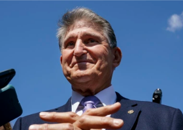

## 'I cannot vote to continue with this piece of legislation'

Democratic Sen. Joe Manchin has been a key holdout on the White House's Build Back Better plan, which aims to bolster the social safety net and fight climate change.

[High stakes for Democrats »](https://www.yahoo.com/finance/news/1-manchin-says-no-bidens-142306001.html)
