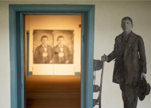

## 'The other slavery': A grim, hidden truth now emerging

Two exhibitions highlight stories of Indigenous bondage in southern Colorado, in an effort to grapple with the lasting trauma.

[Began with Columbus’s first voyage in 1492 »](https://www.yahoo.com/news/grim-long-hidden-truth-emerges-165822149.html)
