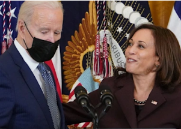

## What Biden doesn't need from Harris speaks volumes

While most presidents promise their vice presidents access and influence, at the end of the day, power and responsibility are not shared equally.

['There is a double standard' »](https://www.yahoo.com/news/heir-apparent-afterthought-frustrations-kamala-125811653.html)
