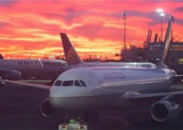

## Airlines forced to cancel Christmas Eve flights

As of Thursday evening, two major U.S. airlines, United and Delta, have been forced to cancel more than 200 flights on the day before Christmas due to the Omicron variant.

['We're sorry for the disruption' »](https://www.yahoo.com/gma/airlines-cancel-holiday-flights-due-012011809.html)
