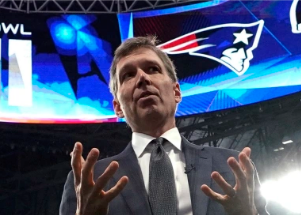

## NFL's chief medical officer makes claim about COVID

Based on his observations during the entire season, Dr. Allen Sills said on the NFL Network on Thursday, asymptomatic players are not spreading COVID-19.

['Got our hands full with symptomatic people' »](https://www.yahoo.com/sports/nfl-medical-officer-asymptomatic-people-024229009.html)
