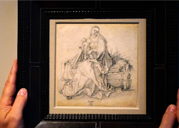

## Man's estate sale find could be worth tens of millions

In 2016, a man purchased a drawing of the Virgin Mary and the baby Jesus for $30 at an estate sale. This month experts at the British Museum in London delivered stunning news.

[Expert dates piece to 1503 »](https://www.yahoo.com/finance/news/paid-30-drawing-could-renaissance-195634176.html)
