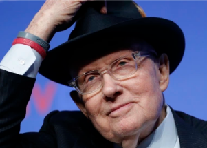

## Former longtime senator and majority leader dies

Harry Reid, known as a firebrand and tough dealmaker, wasn't always in lockstep with the Democratic mainstream during his 30 years in the Senate, the last eight as majority leader.

[Faced adversity growing up in Nevada »](https://www.yahoo.com/gma/harry-reid-former-5-term-013200417.html)
