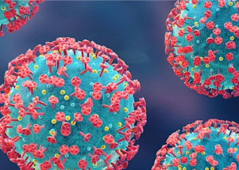

## A positive sign emerges about the Omicron variant

People who have recovered from an infection with the new coronavirus variant may be able to fend off later infections from the Delta variant, according to a new study.

['Something we can live with more easily' »](https://www.yahoo.com/news/omicron-variant-might-help-defend-191714512.html)
