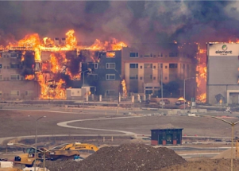

## 30,000 ordered to evacuate 2 cities as Colo. fires rage

Several wind-driven wildfires, with gusts over 100 mph, burned near Denver, blanketing the Boulder County area in smoke and setting vehicles and buildings on fire.

[Several inches of snow in the forecast »](https://www.yahoo.com/news/life-threatening-wildfires-force-evacuations-210045066.html)
