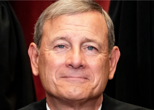

## Chief justice has stern words for federal judiciary

Noting recent reports, Supreme Court Chief Justice John Roberts said more needs to be done to ensure judges don't handle cases where they have financial conflicts.

['Those judges violated an ethics rule' »](https://www.yahoo.com/news/chief-justice-judges-must-better-230100308.html)
