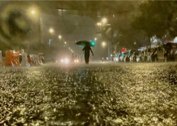

## Study confirms grim reality for cities like NYC and Tokyo

A new study projects more hurricanes will be coming to mid-latitude regions, including major population centers such as New York, Boston and Shanghai.

['Under-estimated risk of climate change' »](https://www.yahoo.com/news/climate-change-will-bring-more-hurricanes-to-new-york-other-mid-latitude-cities-study-finds-184919327.html)
