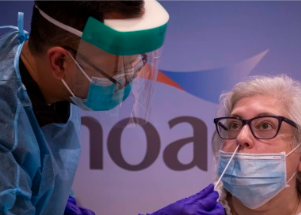

## 'Flurona' detected in U.S. and other countries

Doctors have long been concerned about the potential impact of a "twindemic" and are calling on people to get flu shots and coronavirus vaccinations.

[What we know so far »](https://www.yahoo.com/news/flurona-coronavirus-influenza-co-infections-154230659.html)
