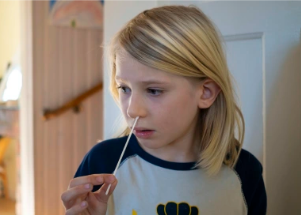

## Omicron is affecting children in a new way

The highly transmissible COVID-19 variant is leaving children with a harsh, barking cough known as croup.

['Scary to hear' »](https://www.yahoo.com/news/omicron-kids-leading-familiar-illness-224338562.html)
