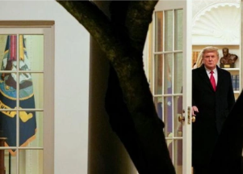

## Man charged after repeatedly threatening to kill Trump

Thomas Welnicki, of Rockaway Beach, N.Y., expressed his interest in killing Trump in a 2020 interview with Capitol Police and in phone calls in 2021 to the Secret Service.

[Trump identified as 'Individual-1' »](https://www.yahoo.com/news/u-charges-york-man-threatening-160536037.html)
