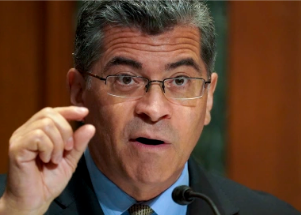

## Unprecedented move at HHS on Medicare premiums

Health and Human Services Secretary Xavier Becerra directed Medicare to consider lowering the premium for the part of the program that covers visits to the doctor and other care.

[Setting an example? »](https://www.yahoo.com/news/unprecedented-move-hhs-asks-officials-211755219.html)
