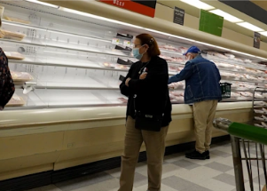

## Why grocery store shelves are empty once again

Shortages at U.S. grocery stores have grown more acute in recent weeks as Omicron spreads and winter storms have piled on to supply chain struggles and labor shortages.

[Hardest-hit items »](https://www.yahoo.com/finance/news/grocery-stores-still-empty-shelves-134952506.html)
