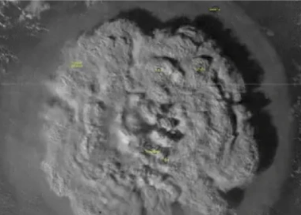

## U.S. West Coast under tsunami advisory

An undersea volcano erupted near the Pacific nation of Tonga on Saturday, sending large waves crashing across the shore and people rushing to higher ground.

[No immediate reports of injuries  »](https://www.yahoo.com/news/tonga-issues-tsunami-warning-undersea-065830694.html)
