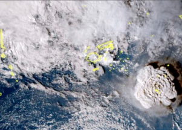

## Tsunami impacts hit U.S. West Coast after volcano eruption

An undersea volcano erupted near the Pacific nation of Tonga on Saturday, sending large waves crashing across the shore and people rushing to higher ground.

[No immediate reports of injuries  »](https://www.yahoo.com/news/tonga-issues-tsunami-warning-undersea-065830694.html)
