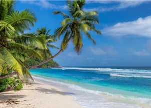

## State will require all visitors to have a COVID booster

Hawaii will require visitors to the state to have received a COVID-19 vaccine booster; visitors who don't comply will be forced to quarantine in the state for five days.

[Redefining 'fully vaccinated' »](https://www.yahoo.com/gma/hawaii-require-travelers-covid-booster-180700542.html)
