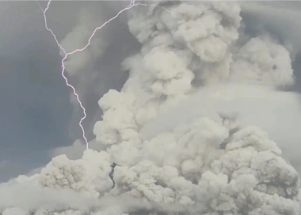

## 'We've never seen anything ... that covers the whole Earth'

Scientists say the Tonga eruption probably won’t cool the planet as some previous eruptions have, but it could affect weather in the short term.

['Unprecedented disaster' »](https://www.yahoo.com/news/heres-scientists-know-tonga-volcano-124800517.html)
