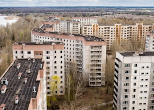

## Abandoned Chernobyl zone suddenly of importance

As Russian troops mass on Ukraine's border, the shortest route to Ukraine's capital, Kyiv, is through the area rendered uninhabitable by the 1986 nuclear disaster.

[Covers about 1,000 square miles  »](https://www.yahoo.com/news/defend-chernobyl-during-invasion-why-162127015.html)
