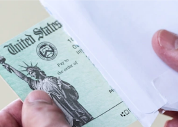

## Tax filers may get unpleasant surprise, experts say

Major changes last year to the tax code — especially to the Child Tax Credit — could mean that some Americans may get smaller-than-expected refunds this year, tax experts say.

[Importance of IRS letter »](https://www.yahoo.com/money/smaller-tax-refunds-this-year-163009073.html)
