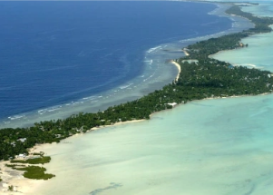

## Lockdown hits one of world's last COVID-free places

The Pacific island nation of Kiribati, which had almost entirely kept the coronavirus out, went into lockdown on Saturday for the first time in the pandemic.

[Airline passengers seen as the culprit »](https://www.yahoo.com/news/kiribati-island-nation-one-worlds-160736708.html)
