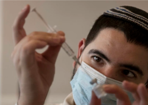

## What Israeli data reveals about 4th COVID vaccine

A fourth dose of COVID-19 vaccine given to people over age 60 in Israel tripled their resistance to serious illness compared with people in the same age group who had three shots.

[1 million participants  »](https://www.yahoo.com/news/fourth-covid-vaccine-shot-sharply-183122510.html)
