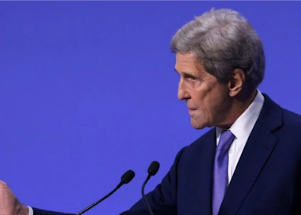

## 'We're in trouble. I hope everyone understands that.'

The world is "not on a good track" to meet a global goal to avoid the worst impacts of climate change, John Kerry, the U.S. special envoy on climate change, said Monday.

[Coal causes concern »](https://www.yahoo.com/news/were-trouble-kerry-warns-countries-145345144.html)
