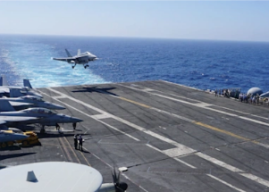

## Navy fighter jet crashes during aircraft carrier landing

A U.S. Navy fighter jet attempting to return to an aircraft carrier in the South China Sea had a landing mishap that left seven sailors injured, according to the military.

[Pilot in stable condition »](https://www.yahoo.com/gma/navy-fighter-jet-crashes-during-211400085.html)
