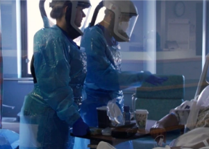

## 'Take care of me,' unvaccinated patients ask of doctors

About 70 percent of patients admitted to the Luminis Health Doctors Community Hospital in Maryland are unvaccinated, as are more than 90 percent of those who die there.

[Doctors have their own support line »](https://www.yahoo.com/news/inside-icu-depleted-staff-struggles-195028673.html)
