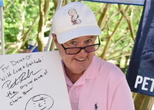

## Peter Robbins, voice of Charlie Brown, dies by suicide

Peter Robbins, 65, who voiced Charlie Brown in the classic 1960s Peanuts cartoons, has died. The former actor took his own life last week.

[He suffered from bipolar disorder »](https://www.yahoo.com/entertainment/peter-robbins-dies-former-child-070839761.html)
