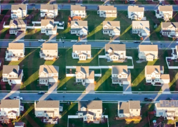

## Could this 'radical' idea solve the housing shortage?

Some lawmakers have begun to roll back laws that made it illegal to build anything other than freestanding homes, but skeptics say this isn't the answer to the housing shortage.

['The 360' »](https://www.yahoo.com/news/would-banning-single-family-zoning-really-solve-the-housing-crisis-223207110.html)
