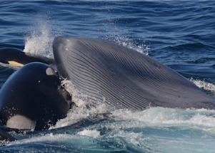

## Scientists witness 'biggest predation event on Earth'

In March 2019, scientists studying whales near Australia stumbled on a supersize spectacle few had seen before — a pod of orcas viciously attacking a blue whale.

['We were astounded' »](https://www.yahoo.com/news/orcas-able-kill-eat-blue-160819944.html)
