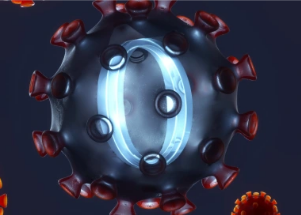

## Cases caused by Omicron cousin BA.2 worry scientists

Scientists are tracking a rise in cases caused by BA.2, a close cousin of the highly transmissible Omicron variant that's starting to outcompete BA.1 in parts of Europe and Asia.

[2 other subvariants being tracked »](https://www.yahoo.com/news/explainer-scientists-alert-over-rising-130643664.html)
