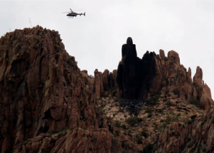

## Hiker dies in 700-foot fall; slipped trying to snap photo

Richard Jacobson, 21, moved to the edge of a steep, unmaintained trail in the Superstition Mountains to take a photo when he slipped, according to a statement from police.

[No signs of drug use or foul play »](https://www.yahoo.com/news/hiker-dies-arizona-falling-700-201303687.html)
