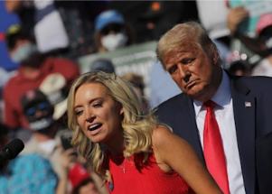

## 'Love that. Thank you. That is the playbook. I will help': Text

Kayleigh McEnany, who was at work in the White House and around then-President Trump during the Capitol attack, was subpoenaed and turned over text messages to investigators.

[Appeared before panel virtually on Jan. 13 »](https://www.yahoo.com/gma/ex-white-house-press-secretary-090300360.html)
