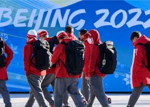

## 1 group at the Olympics is topping virus infections

Figures released by local organizers showed 11 positive tests for COVID-19 among 379 athletes and officials arriving Monday, more than four times the rate of other groups.

[Taken into isolation hotels »](https://www.yahoo.com/sports/virus-infections-olympic-athletes-coaches-105415365.html)
