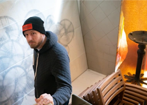

## New attitude toward COVID seems to be taking shape

Fatigued, frustrated and frazzled by five surges over two years, some parts of the U.S. population have decided to simply live with the coronavirus and move on.

[Their numbers are increasing »](https://www.yahoo.com/news/attitude-toward-pandemic-seems-taking-031139858.html)
