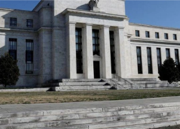

## U.S. on way to economic event not seen in 70 years

The last time the unemployment rate fell below 3%, as one Fed official has predicted it will this year, the Korean War was nearing its end and a recession was just around the corner.

['A red flare' the economy is overheating? »](https://www.yahoo.com/finance/news/u-road-1950s-style-unemployment-111418196.html)
