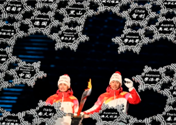

## 'Absolutely disgusting': Critics pounce on Olympic moment

For China, a Uyghur lighting the cauldron was a feel-good moment of ethnic unity. Western critics saw a cynical bid to whitewash human rights abuses in Xinjiang.

[Dinigeer Yilamujian's humbling backstory »](https://www.yahoo.com/news/bearing-olympic-torch-politically-loaded-192147626.html)
