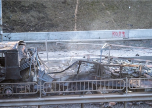

## Russian official issues stark threats to the West

Moscow may respond to Western sanctions by opting out of the last nuclear arms deal with the U.S., Russian Security Council Deputy Chairman Dmitry Medvedev warned.

['We don't feel scared' »](https://www.yahoo.com/news/russian-official-issues-stark-threats-130450444.html)
