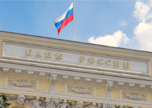

## U.S., allies throw more financial roadblocks at Russia

The U.S., EU and U.K. agreed to crippling sanctions on the Russian financial sector, including blocking access to the global financial system and restrictions on its central bank.

[Targets more than $600 billion in reserves »](https://www.yahoo.com/news/nations-pledge-remove-selected-russian-222929003.html)
