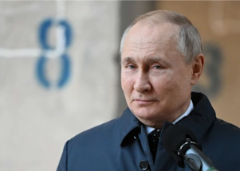

## 'A great shock': Has Vladimir Putin gone totally rogue?

Catherine Belton, a former Moscow-based correspondent for the Financial Times, explains why the battle for Ukraine could be the Russian president's waterloo.

['No one expected him to go this far' »](https://www.yahoo.com/news/putin-ukraine-russia-catherine-belton-skullduggery-152902828.html)
