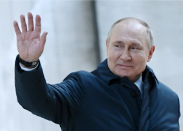

## Putin's fears are becoming a self-fulfilling prophecy, fast

Russian President Vladimir Putin's assault on Ukraine is turning his fears of a more resolute Europe and NATO alliance into a self-fulfilling prophecy.

[Heightened defensiveness toward Russia »](https://www.yahoo.com/news/putins-fears-unified-stronger-europe-210531046.html)
