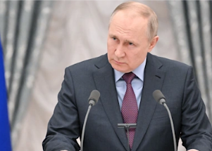

## Switzerland ends decades of neutrality in Putin response

Since launching Russia’s invasion into Ukraine, Vladimir Putin and his country have faced intense global backlash, ranging from sports and culture to crippling economic sanctions.

[Full list of actions so far »](https://www.yahoo.com/news/how-the-world-punished-russia-for-invading-ukraine-192732724.html)
