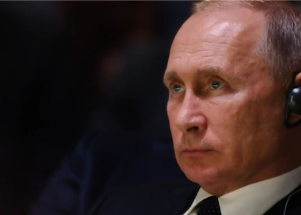

## Washington's newest worry: Dangers of cornering Putin

Surprised by the speed at which sanctions have been poured on Russia, President Biden’s top aides suspect Vladimir Putin’s reaction will be to double down and lash out.

[Concerns accelerated after Putin’s order »](https://www.yahoo.com/news/washingtons-newest-worry-dangers-cornering-130757942.html)
