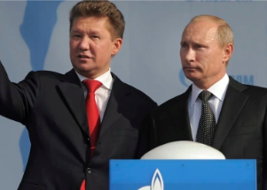

## Longtime Russian energy investor has dire prediction

A Western energy embargo would damage Russia's finances, but Vladimir Putin's control of the oil and gas supply for many nations may be too much to overcome, an asset manager says.

['It's going to be hard' »](https://www.yahoo.com/finance/news/russian-oil-has-europe-in-stranglehold-bill-browder-185738259.html)
