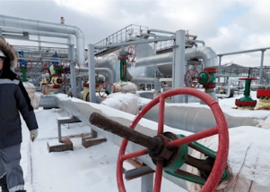

## The likely consequences of a U.S. ban on Russian oil

Russia is the world's top exporter of crude and oil products. A ban would be unprecedented, turbocharging already sky-high prices and risking inflationary shock.

[Where to turn for substitutes »](https://www.yahoo.com/finance/news/u-ban-russian-oil-mean-195502657.html)
