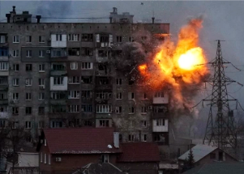

## Zelensky: Mayor's abduction is 'new stage of terror'

In past offensives in Syria and Chechnya, Russia's strategy has been to crush armed resistance with sustained airstrikes and shelling that levels population centers.

['It's ugly already' »](https://www.yahoo.com/news/russians-push-toward-kyiv-keep-051349124.html)
