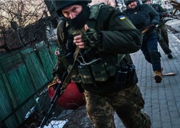

## 'We have warned the U.S.': Russian foreign minister

The White House approved an additional $200 million in weapons and equipment for Ukraine on Saturday, drawing an ominous warning from the Kremlin's Sergei Ryabkov.

[Tough diplomatic talk, heavy military losses »](https://www.yahoo.com/news/russia-intensifies-assault-warns-u-164742510.html)
