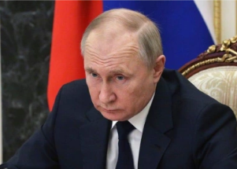

## As sanctions block parts, Russia takes Western airliners

The jets will be added to the country's aircraft register and be deployed on domestic routes, but Western sanctions will make fleet maintenance difficult.

[$10B worth of planes stranded in Russia »](https://www.yahoo.com/news/russia-seizing-western-built-airliners-224955211.html)
