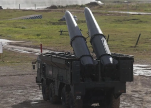

## U.S. makes discovery about Russia's ballistic missiles

Iskander-M short-range ballistic missiles are releasing a previously unknown decoy designed to evade air-defense systems, an American official said.

['I had never seen this' »](https://www.yahoo.com/news/russia-deploys-mystery-munition-ukraine-114716254.html)
