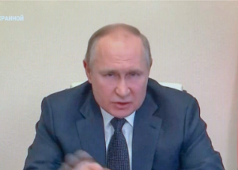

## Putin: Critics won't be allowed into 'the superior race'

The speech Russian President Vladimir Putin made on Wednesday bore the hallmarks of unapologetic authoritarianism, Russia experts and observers said.

['Don't betray the motherland' »](https://www.yahoo.com/news/putin-echoes-stalin-in-very-very-scary-speech-185956140.html)
